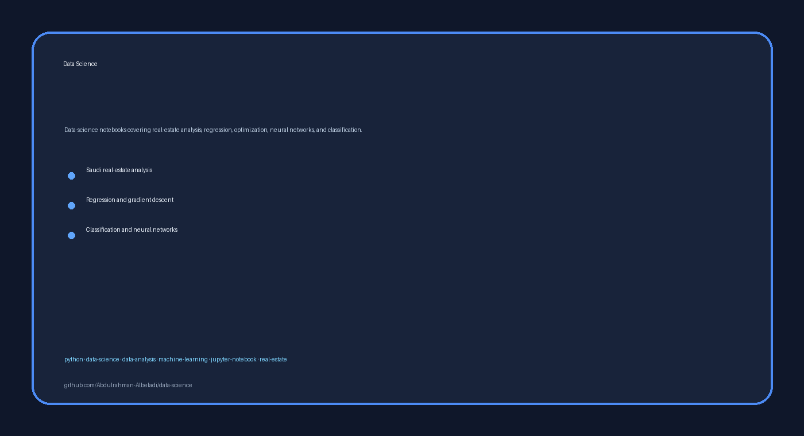

# Data Science

<!-- employer-visual:start -->

  

<!-- employer-visual:end -->

Data-science notebooks covering real-estate analysis, regression, optimization, neural networks, and classification.

**Technologies:** Python · Jupyter · pandas · NumPy · scikit-learn · Matplotlib

## Highlights

- Saudi real-estate analysis using a large structured dataset.
- Regression, gradient-descent, and neural-network exercises.
- Classifier comparison and model-evaluation workflows.

## Projects

| Project | Location |
|---|---|
| Saudi Real Estate Analysis | [`projects/saudi-real-estate-analysis`](projects/saudi-real-estate-analysis) |
| Regression, Gradient Descent, and Neural Networks | [`projects/regression-gradient-descent-neural-networks`](projects/regression-gradient-descent-neural-networks) |
| Classifiers | [`projects/classifiers`](projects/classifiers) |

## Getting started

1. Open the selected notebook in JupyterLab or Google Colab.
2. Install the notebook's imported libraries in an isolated environment.
3. Use the included public-safe data or provide the documented local dataset.

## Portfolio note

Large or restricted source datasets are not necessarily included; notebooks document the analytical workflow and results.

## License and attribution

Use and redistribution are governed by the repository's [`LICENSE`](LICENSE).
